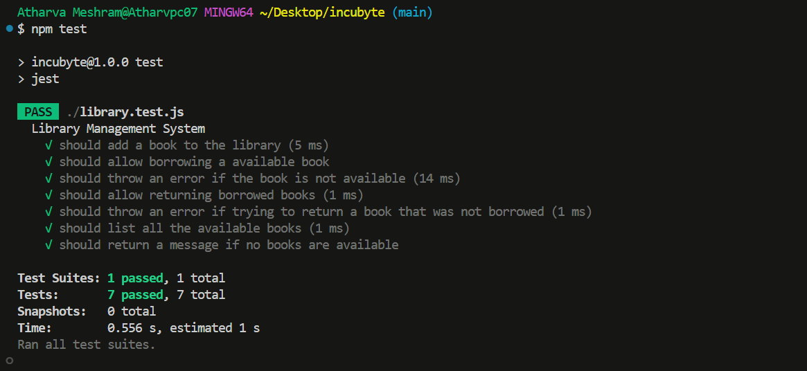

# Library Management System

**Kata: Library Management System**

- **Objective**
  Create a simple library management system that allows users to perform basic operations
  such as adding books, borrowing books, returning books, and viewing available books.

## Requirements

- **Add Books**: Add a book with `ISBN`, `title`, `author`, and `publication_year`.
- **Borrow Books**: Borrow a book if it's available.
- **Return Books**: Return a borrowed book and mark it as available.
- **View Available Books**: View a list of all books currently available for borrowing.

## Installation/Usage

Make sure you have **Node.js** installed. You can download it from [here](https://nodejs.org/).

You will also need **npm** (which comes with Node.js) and **Jest** for running the tests.

1. Clone the repository:
   ```bash
   git clone https://github.com/im-atharva/KATA-LMS
   ```
2. Navigate to the Project Directory:
   ```bash
   cd library-management-system
   ```
3. Install the dependencies
   ```
   npm install
   ```

## Running the Tests

The project follows a Test-Driven Development (TDD) approach. Tests are written using Jest and can be run with the following command:

```
    npm test
```

## Test Reports

Here is the report showing the results of the unit tests.


